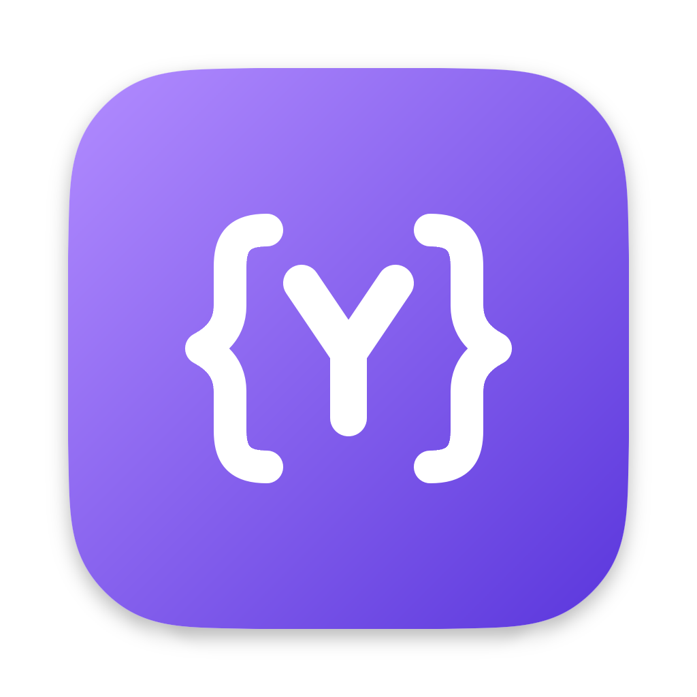

<p align="center"></p>

# Yeek

Yeek is an experiment: can [MyGo](https://github.com/egoist/mygo) carry a full-featured desktop app? It rebuilds the [Yaak](https://github.com/mountain-loop/yaak) API client in Go, aiming to match Yaak's interface and behaviour, with MyGo's native UI toolkit in place of a web view.

> [!NOTE]
> Yeek is a personal experiment, not a product. It is not affiliated with or endorsed by Yaak, and it may change or break without notice.

## The experiment

Yaak is a mature API client built with Tauri and React. Rebuilding it puts MyGo under the load of a real app rather than a demo:

- **Native UI only.** Every screen is drawn by MyGo's Go UI toolkit, with no HTML, CSS or JavaScript of Yeek's own. That includes the code editor with syntax colors, folding and find/replace, the sidebar tree, dialogs, menus, and the Markdown preview. The one web view is OAuth sign-in, which shows the identity provider's own login page.
- **Pure Go.** The HTTP, GraphQL, gRPC and WebSocket clients, template engine, importers, filesystem sync and Git all run in Go, so `go run .` is the whole development loop.
- **Toolkit extensions.** Where the stock toolkit fell short, Yeek extends a vendored copy in `third_party/mygo-ui`. Its `UPSTREAM.md` records the base version and each change.
- **Headless UI tests.** The interface is driven by MyGo's headless tester: clicking, typing and rendering screenshots without opening a window.
- **Packaging.** `mygo build` produces the macOS app bundle; `scripts/mac-debug.sh` produces a debug build that runs beside it.

Yaak is the reference. Workspaces, Yaak-format filesystem sync and imports are meant to stay compatible with it.

## Getting started

Requires Go 1.27.1 or newer.

```sh
go run .
go tool mygo dev
go tool mygo build -skip-dmg
```

The macOS bundle is written to `build/darwin-arm64/Yeek.app`. MyGo's build command also accepts `-platform` for other targets.

`scripts/mac-debug.sh` builds `build/debug/Yeek Debug.app` on macOS: a debug build with MyGo's development features, its own bundle identifier and data directory, and the debug icon, so it runs beside a release Yeek. Pass `--open` to launch it after building.

## Features

Use `go run . --data-dir /path/to/data` to select a separate data directory. Workspaces, settings, and request history are stored in SQLite. Response bodies are stored beside the database. Workspace encryption keys are protected by the operating system keychain.

The native interface includes HTTP and GraphQL requests, WebSocket sessions, unary and streaming gRPC, environments, inherited authentication and headers, cookie jars, request history, response filtering, and theme selection. Collections can be imported from Yaak, Postman, Insomnia, OpenAPI, Bruno, and cURL. Filesystem sync uses Yaak-compatible YAML files, and Git operations use a Go implementation.

Import Data previews files, Bruno folders, URLs, or pasted collections before applying them to a new or existing workspace. Linked sources can be reimported with per-resource selection and conflict choices; deletions require selection. Unlinking a source leaves its requests intact. OpenAPI references resolve relative to their file or URL, with local references restricted to the selected source directory. Postman request scripts are retained as metadata and are not executed.

OpenAPI 3.x and Swagger 2 imports map server environments, authentication overrides, tags, parameter styles, and JSON/XML/form examples. Export Data selects one or more workspaces; private environments are included only when selected. Exports omit request history, cookie jars, and local source links.

The native code editor supports syntax colors, line numbers, block folding, indentation, bracket pairing, Unicode input, find/replace, and line navigation. Use Cmd/Ctrl+F to find, Cmd/Ctrl+Alt+F to replace, and Ctrl+G to go to a line and column. Its MyGo UI extensions are kept in `third_party/mygo-ui`, with the upstream version and license recorded there.

Multipart fields support text, files, custom filenames, and per-part Content-Type through Field Options. Uploads are prepared as disk snapshots for stable retries and request history. Binary files have an optional Content-Type suggestion. The method selector supports custom methods. JSON bodies strip comments and trailing commas by default; JSON body settings can preserve them. GraphQL GET requests put their query, variables, and operation name in the URL.

Type a variable or function name, or press Ctrl+Space, for template suggestions in request fields and bodies. Function forms support literal values and nested expressions. Use the field's context menu to insert or edit a template. Previews use saved responses and do not send referenced requests or evaluate secret, file, prompt, or plugin functions.

`prompt.text` asks for a value when the request is sent; cancelling the dialog cancels the request. Answers can be remembered for the session or for a number of seconds. Remembered answers are kept in memory only and can be cleared from Settings → Forget Prompted Values.

A folder's context menu has Send All, which sends its HTTP requests and those of its subfolders one at a time in sidebar order.

GraphQL editors complete schema fields, arguments, input types, variables, and fragments, and show query and variable errors. Use the Schema menu to control automatic introspection or load an SDL or introspection JSON file. Saved schemas remain available after restarting the app. The operation selector controls which named operation is sent.

The cookie menu selects a jar for the current workspace and opens its editor. Cookies can be filtered, created, edited, or deleted with their domain, path, expiry, and security attributes. Response cookie views include redirect exchanges. Cookie updates from requests preserve unrelated edits made while those requests are running.

Settings → Certificates supports PEM keys, encrypted PKCS#8 keys, and PFX/PKCS#12 files, scoped to a host and optional port. Workspace settings provide DNS overrides and additional PEM/DER certificate authorities. Custom HTTP, HTTPS, and SOCKS5 proxies support authentication and bypass rules; gRPC uses the same proxy and DNS configuration. Automatic proxy mode reads the environment proxy variables.

OAuth supports authorization code, implicit, client credentials, password, and refresh-token grants. The native auth editor configures PKCE, client assertions, token selection, and custom authorization/token/refresh parameters. Sign-in can use a MyGo-managed provider window or the system browser with a loopback callback. Token requests use the workspace network configuration. Cached tokens refresh when expired and are encrypted separately from collection data; explicit tokens and credentials entered in request configuration remain part of exports. Request history can contain sent authentication headers.

## Go plugins

A plugin is a Go source file exporting a `Plugin` variable of type `plugin.Definition`. Load it from Settings → Plugins. The API is in [plugin/plugin.go](plugin/plugin.go); plugins can contribute template functions, authentication, request hooks, actions, importers, response filters, and themes.

```go
package extension

import (
    "strings"
    "yeek/plugin"
)

var Plugin = plugin.Definition{
    Name: "Text Tools",
    Version: "1.0.0",
    Templates: []plugin.Template{{
        Name: "text.upper",
        Fields: []plugin.Field{{Name: "value", Label: "Value"}},
        Run: func(ctx plugin.Context, args map[string]string) (string, error) {
            return strings.ToUpper(args["value"]), nil
        },
    }},
}
```

The function can then be used as `${[ text.upper(value='hello') ]}` in a request or environment variable.

## Development

```sh
go test ./internal/engine ./internal/desktop
golangci-lint run --no-config
govulncheck ./...
gosec -tests -exclude-generated ./...
```

`go run ./cmd/fixture` starts loopback HTTP, cookie, WebSocket, SSE, GraphQL, image, CSV, and gRPC endpoints for native interface checks. `go run ./cmd/icon` regenerates the app icon, the Yeek mark (a Y in curly braces); `-variant debug` draws the debug build's pink-on-black icon.

Add `-tls-dir /path/to/test-keys` to the fixture command to generate synthetic certificates and enable the mTLS endpoint on port 9842. The generated client PFX uses the passphrase `fixture-pass`.

## License

Yeek is released under the [MIT License](LICENSE).

It builds on [MyGo](https://github.com/egoist/mygo) (MIT) and adapts model conventions and theme palettes from [Yaak](https://github.com/mountain-loop/yaak) (MIT). Their notices are in `third_party/NOTICE`, `third_party/MyGo-LICENSE` and `third_party/Yaak-LICENSE`, and the licenses of other dependencies are in `third_party/DEPENDENCY_LICENSES.txt`. All of these ship inside the app.
